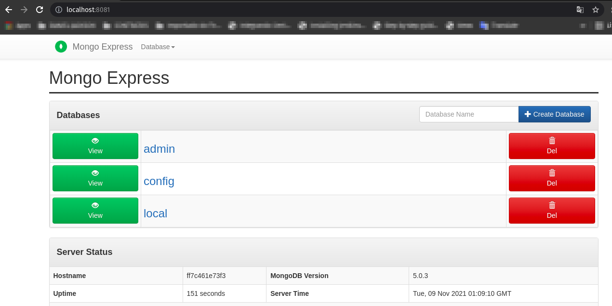

## Docker com MongoDB e MongoExpress
Rodando Docker | MongoDB | Mongo Express

<<<<<<< HEAD
Imagem Mongo Express
{https://hub.docker.com/_/mongo-express}
=======
# 1 Imagem Mongo Express
https://hub.docker.com/_/mongo-express
>>>>>>> b30baefdd3938f352c7f4351f72ae3cc6e74e26a

# 2 - Criando o volume
É preciso criar um volume para que os dados permanessão 
...

docker volume create mongo_db
...
# 3 - Criar a rede de comunicação entre os containers

docker network create net_mongo

# 4 Criando a imagem do Mongo

docker container run --name mongoDB -v "base_mongo:/dados" -d mongo:latest

# 5 Vinculando a imagem na rede
docker network connect net_mongo <ID da imagem>

# 6 Criando a imagem do Mongo-Express
docker container run --network NetMongo \
-e ME_CONFIG_MONGODB_SERVER=mongoDB \
-p 8081:8081 mongo-express:0.54.0

# Mongo Express
